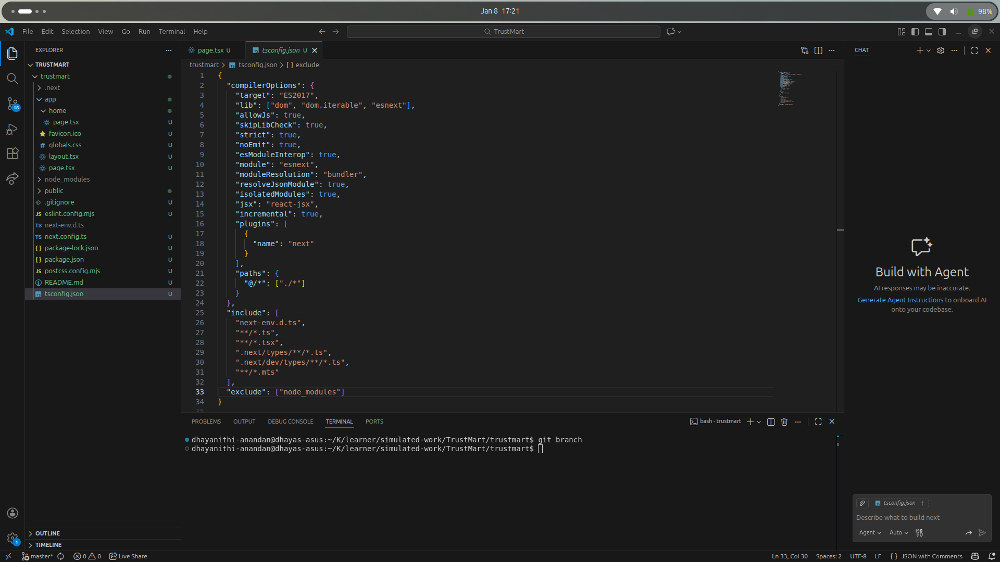
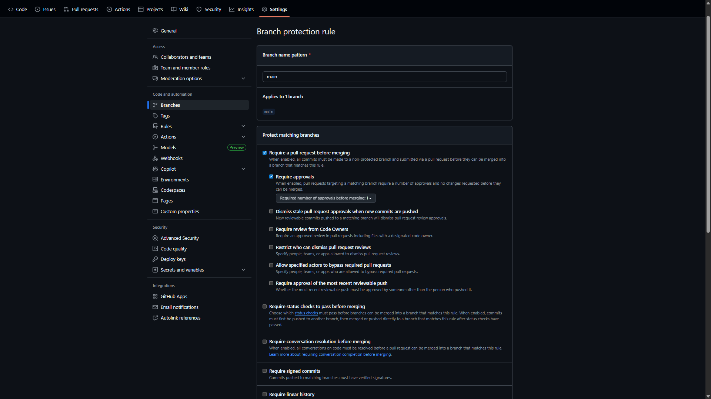

**completed 2.8 (Jan 8 2026)**



# completed 2.8 (Jan 9 2026)

## Code Review Checklist

Before approving a PR, reviewers must ensure:

- Linting and build checks pass
- No console errors or warnings
- Feature works as expected
- Code is readable and well-structured
- Naming conventions are followed
- No security or sensitive data issues
- Proper screenshots or evidence attached



**completed 2.10 (Jan 9 2026)**
Stores actual environment-specific secrets (API keys, database URLs, tokens) used during local development.
This file is not committed to version control to prevent exposing sensitive data.

.env.example

Provides a template of required environment variables with placeholder values.
This file is committed to help other developers know which variables must be configured before running the project.

---

# Global API Response Handler

This project implements a standardized API response format across all endpoints to ensure consistency, improve developer experience, and enhance observability.

## Response Format

All API endpoints return responses in a unified structure:

### Success Response
```json
{
  "success": true,
  "message": "Users fetched successfully",
  "data": [
    { "id": 1, "name": "Alice", "email": "alice@example.com" },
    { "id": 2, "name": "Bob", "email": "bob@example.com" }
  ],
  "timestamp": "2025-10-30T10:00:00Z"
}
```

### Error Response
```json
{
  "success": false,
  "message": "Missing required field: name",
  "error": {
    "code": "VALIDATION_ERROR",
    "details": "Name field is required for user creation"
  },
  "timestamp": "2025-10-30T10:00:00Z"
}
```

## Usage Examples

### Import the Handler
```typescript
import { sendSuccess, sendError } from "../../../lib/responseHandler";
import { ERROR_CODES } from "../../../lib/errorCodes";
```

### Success Response
```typescript
export async function GET() {
  try {
    const users = await fetchUsers();
    return sendSuccess(users, "Users fetched successfully");
  } catch (err) {
    return sendError("Failed to fetch users", ERROR_CODES.USER_FETCH_ERROR, 500);
  }
}
```

### Error Response
```typescript
export async function POST(req: Request) {
  try {
    const data = await req.json();
    if (!data.name) {
      return sendError("Missing required field: name", ERROR_CODES.VALIDATION_ERROR, 400);
    }
    // Create user logic...
    return sendSuccess(newUser, "User created successfully", 201);
  } catch (err) {
    return sendError("Internal Server Error", ERROR_CODES.USER_CREATION_FAILED, 500);
  }
}
```

## Error Codes

The application uses standardized error codes for consistent error tracking:

| Code | Description |
|------|-------------|
| E001 | VALIDATION_ERROR |
| E002 | NOT_FOUND |
| E003 | DATABASE_FAILURE |
| E500 | INTERNAL_ERROR |
| E401 | UNAUTHORIZED |
| E403 | FORBIDDEN |
| E409 | CONFLICT |
| E429 | RATE_LIMIT_EXCEEDED |
| E101 | USER_FETCH_ERROR |
| E102 | USER_CREATION_FAILED |
| E201 | TASK_CREATION_FAILED |
| E202 | TASK_FETCH_ERROR |

## Available API Endpoints

### Users API
- `GET /api/users` - Fetch all users
- `POST /api/users` - Create a new user

### Tasks API
- `GET /api/tasks` - Fetch all tasks
- `POST /api/tasks` - Create a new task
- `PUT /api/tasks?id={taskId}` - Update a task
- `DELETE /api/tasks?id={taskId}` - Delete a task

## Benefits

1. **Consistent Developer Experience**: All endpoints return the same response structure
2. **Easier Debugging**: Every error includes a code and timestamp
3. **Better Observability**: Easy integration with monitoring tools
4. **Simplified Frontend Logic**: Predictable response handling
5. **Team Collaboration**: New developers quickly understand the API structure

## Developer Experience & Observability

The global response handler provides:

- **Faster Debugging**: Every error has a standardized code and timestamp
- **Reliable Frontend Development**: All responses share the same schema
- **Monitoring Integration**: Easy to integrate with tools like Sentry, Datadog, or Postman monitors
- **Improved Onboarding**: New team members instantly understand the response format

Think of the global response handler as your project's "API voice" — every endpoint speaks in the same tone, no matter who wrote it.

---

# Zod Input Validation

This project uses Zod for TypeScript-first schema validation to ensure all API endpoints receive valid, well-structured data before processing.

## Why Input Validation Matters

Without proper validation:
- Malformed JSON or missing fields can crash your API
- Invalid data can corrupt your database
- Security vulnerabilities can emerge from unchecked inputs
- Frontend applications receive unpredictable error responses

Zod provides a safety layer that validates inputs before they reach your business logic.

## Schema Definitions

### User Schema (`lib/schemas/userSchema.ts`)

```typescript
import { z } from "zod";

export const userSchema = z.object({
  name: z.string().min(2, "Name must be at least 2 characters long").max(50, "Name must be less than 50 characters"),
  email: z.string().email("Invalid email address"),
  age: z.number().min(18, "User must be 18 or older").max(120, "Age must be less than 120"),
  role: z.enum(["user", "admin", "moderator"]).default("user"),
  isActive: z.boolean().default(true),
});

export type UserInput = z.infer<typeof userSchema>;
```

### Task Schema (`lib/schemas/taskSchema.ts`)

```typescript
import { z } from "zod";

export const taskSchema = z.object({
  title: z.string().min(1, "Title is required").max(200, "Title must be less than 200 characters"),
  description: z.string().max(1000, "Description must be less than 1000 characters").optional(),
  status: z.enum(["pending", "in-progress", "completed"]).default("pending"),
  priority: z.enum(["low", "medium", "high"]).default("medium"),
  dueDate: z.string().datetime().optional(),
  assignedTo: z.string().email().optional(),
});

export type TaskInput = z.infer<typeof taskSchema>;
```

## Validation in API Routes

### Example: Creating a User

```typescript
import { ZodError } from "zod";
import { userSchema } from "../../../lib/schemas/userSchema";

export async function POST(req: Request) {
  try {
    const body = await req.json();
    
    // Validate input using Zod schema
    const validatedData = userSchema.parse(body);
    
    // Process validated data...
    return sendSuccess(validatedData, "User created successfully", 201);
  } catch (err) {
    if (err instanceof ZodError) {
      return sendError(
        "Validation failed", 
        ERROR_CODES.VALIDATION_ERROR, 
        400, 
        err.issues.map((e: any) => ({ 
          field: e.path.join('.'), 
          message: e.message 
        }))
      );
    }
    
    return sendError("Internal Server Error", ERROR_CODES.INTERNAL_ERROR, 500);
  }
}
```

## Testing Validation

### ✅ Valid Request Example

```bash
curl -X POST http://localhost:3000/api/users \
-H "Content-Type: application/json" \
-d '{
  "name": "Alice Johnson",
  "email": "alice@example.com",
  "age": 25,
  "role": "user"
}'
```

**Response:**
```json
{
  "success": true,
  "message": "User created successfully",
  "data": {
    "name": "Alice Johnson",
    "email": "alice@example.com",
    "age": 25,
    "role": "user",
    "isActive": true
  },
  "timestamp": "2025-10-30T10:00:00Z"
}
```

### ❌ Invalid Request Example

```bash
curl -X POST http://localhost:3000/api/users \
-H "Content-Type: application/json" \
-d '{
  "name": "A",
  "email": "not-an-email",
  "age": 15
}'
```

**Response:**
```json
{
  "success": false,
  "message": "Validation failed",
  "error": {
    "code": "VALIDATION_ERROR",
    "details": [
      { "field": "name", "message": "Name must be at least 2 characters long" },
      { "field": "email", "message": "Invalid email address" },
      { "field": "age", "message": "User must be 18 or older" }
    ]
  },
  "timestamp": "2025-10-30T10:00:00Z"
}
```

## Schema Reuse Between Client and Server

A major benefit of Zod is schema reuse across your full-stack application:

```typescript
// Shared schema file: lib/schemas/userSchema.ts
export const userSchema = z.object({
  name: z.string().min(2),
  email: z.string().email(),
});

// Export inferred types
export type UserInput = z.infer<typeof userSchema>;

// Client-side validation
import { userSchema } from '../lib/schemas/userSchema';

const validateUserForm = (formData: unknown) => {
  try {
    return userSchema.parse(formData);
  } catch (error) {
    // Handle validation errors
    throw error;
  }
};
```

## Benefits of Zod Validation

1. **Type Safety**: Automatic TypeScript type inference from schemas
2. **Descriptive Errors**: Clear, human-readable validation messages
3. **Runtime Validation**: Catches invalid data before it causes issues
4. **Schema Reuse**: Same validation logic on client and server
5. **Developer Experience**: Excellent IDE support and autocompletion
6. **Performance**: Fast validation with minimal overhead

## Validation Rules by Endpoint

### Users API
- **POST /api/users**: Requires `name`, `email`, `age`. Optional: `role`, `isActive`
- **PUT /api/users?id={userId}**: Partial updates allowed, all fields optional

### Tasks API
- **POST /api/tasks**: Requires `title`. Optional: `description`, `status`, `priority`, `dueDate`, `assignedTo`
- **PUT /api/tasks?id={taskId}**: Partial updates allowed, all fields optional

## Best Practices

1. **Validate Early**: Validate input at the API boundary
2. **Be Specific**: Use descriptive error messages
3. **Use Types**: Leverage TypeScript inference for better DX
4. **Reuse Schemas**: Share validation logic between client and server
5. **Handle Gracefully**: Always catch and format validation errors properly

Validation consistency ensures your API remains predictable, secure, and maintainable across the entire development team.
